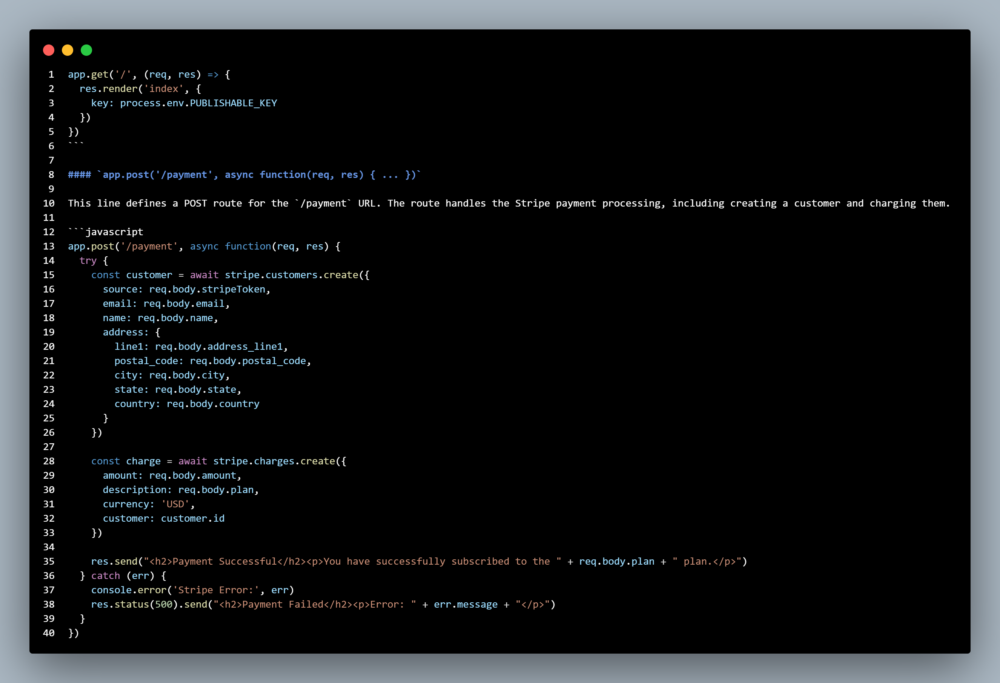
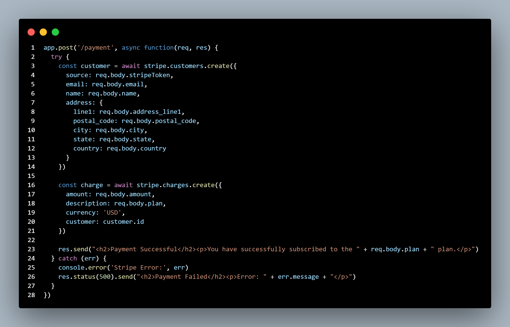
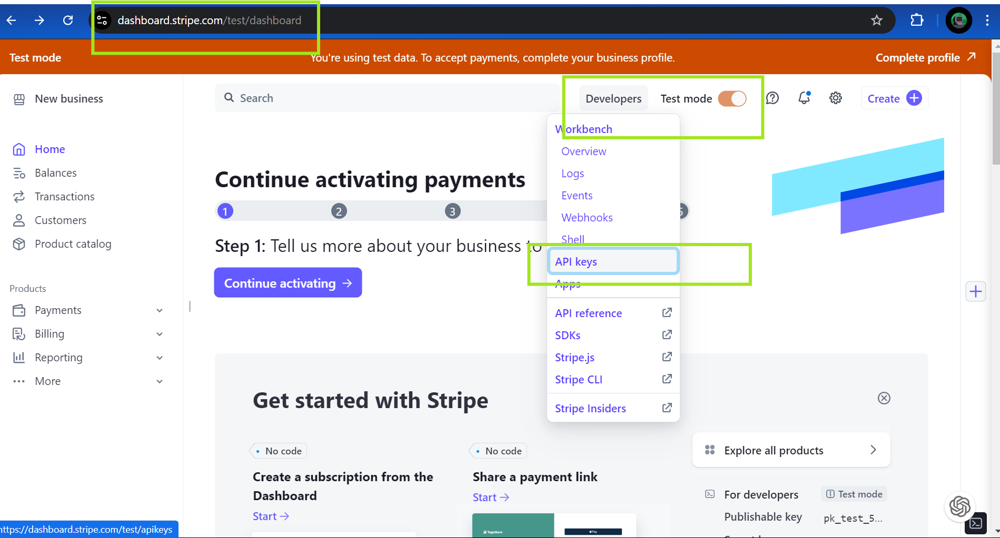
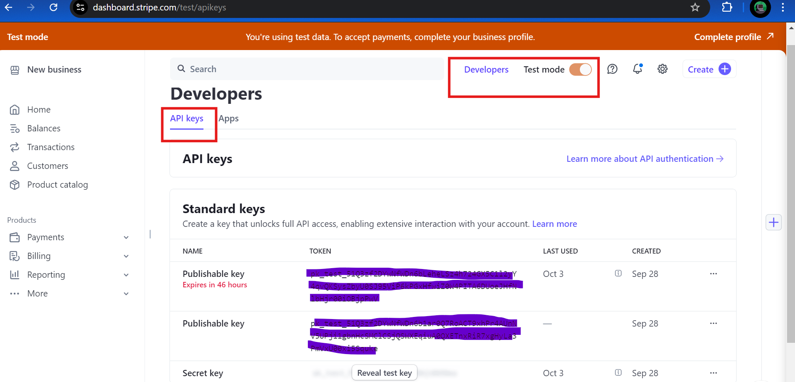
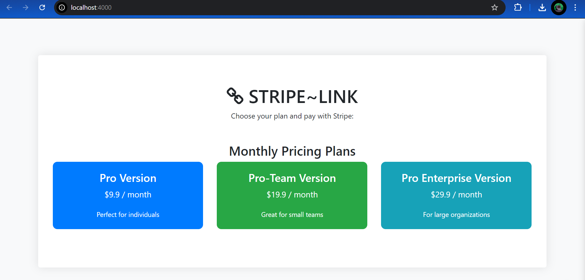
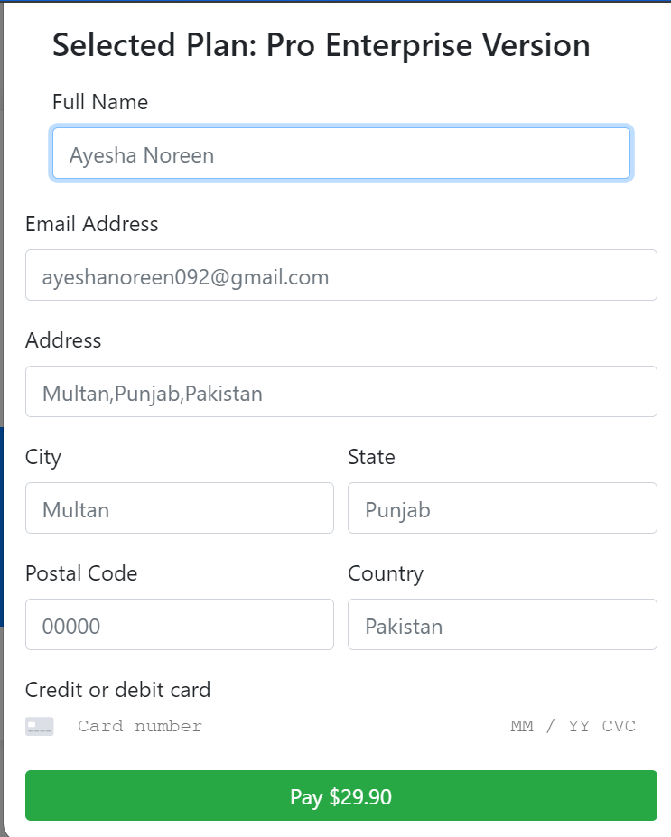
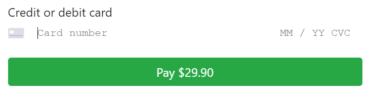
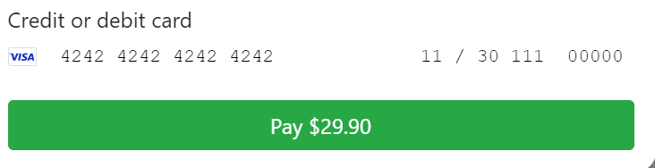
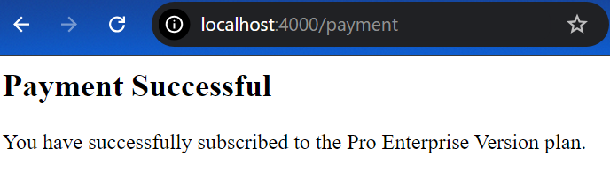

<div align="center">
  <h1> Stripe API Integration with Node.js and Express.js</h1>
  <a class="header-badge" target="_blank" href="https://www.linkedin.com/in/khatoonintech/">
  
  </a>
  

<sub>Author:
<a href="https://www.linkedin.com/in/Khatoonintech/" target="_blank">Ayesha Noreen</a><br>
<small> SWE Fellow @Confiniti Labs </small>
</sub>
<br>
<br>
<br>
	  


</div>

---

This project integrates the Stripe API with a Node.js and Express.js application. It allows users to select a payment plan and make a payment using Stripe.

## Table of Contents
-----------------

**Table of Contents**

1. [Project Structure](#project-structure)
2. [Project Files](#project-files)
	* [app.js File](#appjs-file)
	* [.env File](#env-file)
	* [package.json File](#packagejson-file)
	* [package-lock.json File](#package-lockjson-file)
	* [index.ejs File](#indexejs-file)
3. [Functionality](#functionality)
4. [Deployment](#deployment)
5. [Testing the smooth Payment Transaction](#testing-the-smooth-payment-transaction)
6. [Security Considerations](#security-considerations)
7. [Troubleshooting](#troubleshooting)
8. [Conclusion](#conclusion)


## Project Structure
-----------------

The project has the following structure:

```
|-app.js
|-.env
|-package-lock.json
|-package.json
|-views---|
                |-index.ejs
                |-style.css
```

| File/Directory | Description |
| --- | --- |
| `app.js` | Main application file |
| `.env` | Environment variables file |
| `package-lock.json` | Dependency lock file |
| `package.json` | Dependency file |
| `views` | Directory for view files |
| `index.ejs` | Main view file |
| `style.css` | Stylesheet file |

## Project Files
-------------


## `app.js` File
--------------

This is the main file that sets up the Express.js application and handles the Stripe payment integration.

### Line-by-Line Explanation

#### 1. `require('dotenv').config()`

This line requires the `dotenv` module and loads the environment variables from the `.env` file.

#### 2. `const express = require('express')`

This line requires the `express` module and assigns it to the `express` variable.

#### 3. `const bodyparser = require('body-parser')`

This line requires the `body-parser` module and assigns it to the `bodyparser` variable.

#### 4. `const path = require('path')`

This line requires the `path` module and assigns it to the `path` variable.

#### 5. `const app = express()`

This line creates a new Express.js application instance and assigns it to the `app` variable.

#### 6. `const stripe = require('stripe')(process.env.SECRET_KEY)`

This line requires the `stripe` module and initializes it with the `SECRET_KEY` environment variable.

#### 7. `app.use(bodyparser.urlencoded({ extended: false }))`

This line sets up the `body-parser` middleware to parse URL-encoded request bodies.

#### 8. `app.use(bodyparser.json())`

This line sets up the `body-parser` middleware to parse JSON request bodies.

#### 9. `const port = 4000`

This line sets the port number to 4000.

#### 10. `process.env.NODE_NO_WARNINGS = 1`

This line sets the `NODE_NO_WARNINGS` environment variable to 1.

#### 11. `app.set('view engine', 'ejs')`

This line sets the view engine to `ejs`.

#### 12. `app.set('views', path.join(__dirname, 'views'))`

This line sets the views directory to the `views` directory in the current directory.

#### 13. `app.get('/', (req, res) => { ... })`

This line defines a GET route for the root URL (`/`).

#### 14. `app.post('/payment', async function(req, res) { ... })`

This line defines a POST route for the `/payment` URL.

#### 15. `app.use((err, req, res, next) => { ... })`

This line sets up an error handling middleware function.

#### 16. `process.on('unhandledRejection', (reason, promise) => { ... })`

This line sets up an event handler for unhandled promise rejections.

#### 17. `app.listen(port, () => { ... })`

This line starts the server and listens on the specified port.

### Detailed Explanation of Key Lines

#### `app.get('/', (req, res) => { ... })`

This line defines a GET route for the root URL (`/`). The route renders the `index.ejs` view and passes the `PUBLISHABLE_KEY` environment variable to the template.



#### `app.post('/payment', async function(req, res) { ... })`

This line defines a POST route for the `/payment` URL. The route handles the Stripe payment processing, including creating a customer and charging them.



## `.env`

This file contains the Stripe API keys (`PUBLISHABLE_KEY` and `SECRET_KEY`) that are used in the application.

| Variable | Description |
| --- | --- |
| `PUBLISHABLE_KEY` | The Stripe publishable API key, used on the client-side to initialize the Stripe.js library. |
| `SECRET_KEY` | The Stripe secret API key, used on the server-side to interact with the Stripe API. |

### Steps to get Stripe API keys

Get these keys by following the guide below

<h3>Step # 1:</h3>
- Go to the [Stripe Dashboard](https://dashboard.stripe.com/)
- Follow the instructions prompted to you and create an account
- Get to the [following page](https://dashboard.stripe.com/test/dashboard)



<h3>Step # 2:</h3>
- Get to the [following page](https://dashboard.stripe.com/test/dashboard)
- Get Your API keys from this page



### NOTE :
- Remain in the TEST mode
- Protect your API keys

## `package.json`

This file defines the project's dependencies and scripts. The main dependencies are:

| Dependency | Description |
| --- | --- |
| `dotenv` | Loads environment variables from the `.env` file. |
| `express` | The web application framework used in the project. |
| `body-parser` | Middleware for parsing request bodies. |
| `ejs` | The templating engine used to generate dynamic HTML. |
| `stripe` | The Stripe API client library for Node.js. |

The `start` script uses `nodemon` to run the application in development mode.

## `package-lock.json`

This file is automatically generated and locks the versions of the dependencies used in the project.

## `index.ejs`

This is the main view file that displays the payment options and the Stripe payment form.

The file includes the necessary HTML structure, including a `<head>` section with stylesheets and a `<body>` section with the payment options and the Stripe payment form. The view displays three different payment plans (Pro Version, Pro-Team Version, and Pro Enterprise Version) with their respective prices.

When a user clicks on a payment plan button, a modal is displayed with a Stripe payment form. The form collects the user's name, email, address, and credit card information. The view includes the necessary script tags to integrate the Stripe.js library and handle the payment form submission.

The view also includes custom CSS styles to enhance the appearance of the payment options and the Stripe payment form.
#### Payment Options

The view displays three different payment plans (Pro Version, Pro-Team Version, and Pro Enterprise Version) with their respective prices.


#### Stripe Payment Form

The view includes a modal that displays the Stripe payment form when a user selects a payment plan. The form collects the user's name, email, address, and credit card information.


#### Stripe.js Integration

The view includes the necessary script tags to integrate the Stripe.js library and handle the payment form submission.

#### CSS Styling

The view includes custom CSS styles to enhance the appearance of the payment options and the Stripe payment form.


### `package.json`

This file defines the project's dependencies and scripts. The main dependencies are:

*   `dotenv`: for loading environment variables
*   `express`: for the web application
*   `body-parser`: for parsing request bodies
*   `ejs`: for the templating engine
*   `stripe`: for the Stripe payment integration

The `start` script uses `nodemon` to run the application in development mode.

## Functionality
-------------

The application provides a simple interface for users to choose a payment plan and make a payment using Stripe. When a user clicks on a payment plan button, a modal is displayed with a Stripe payment form. The user can enter their payment information, and the application will handle the payment processing with Stripe.

## Deployment
------------

To deploy this application, you will need to:

1.  Set up a server to host the application.
2.  Install the necessary dependencies using `npm install`.
3.  Set the Stripe API keys in the `.env` file.
4.  Start the application using the `npm start` command.

Make sure to configure any necessary environment variables, such as the Stripe API keys, on the production server.
 

## Testing the smooth Payment Transaction
------------------------------------------

 To test the smooth payment transaction on http://localhost:4000  make sure to use the following credential details:

 1. Card Number : 4242 4242 4242 4242
 2. Date (MM/YY) : any date in the format of MM/YY like 02/30
 3. CVC : any number in the format of 000
 4. ZIP : any zip code in the format of 00000



put the following values into the boxes:



After the successful payment transaction, it shows the Sucess Message


## Security Considerations
----------------------

*   **Stripe API Keys**: Make sure to keep your Stripe API keys secure and do not expose them in your code or configuration files.
*   **Payment Information**: Make sure to handle payment information securely and in compliance with PCI-DSS standards.
*   **Error Handling**: Make sure to handle errors securely and do not expose sensitive information to users.

## Troubleshooting
-----------------

*   **Stripe API Errors**: Check the Stripe API documentation for error codes and troubleshooting guides.
*   **Payment Processing Issues**: Check the payment processing logs for errors and issues.
*   **Application Errors**: Check the application logs for errors and issues.

By following these guidelines and best practices, you can ensure a secure and reliable Stripe API integration with your Node.js and express.js

## Conclusion

This project demonstrates how to integrate Stripe payment processing into a Node.js and Express.js application. The application provides a simple and user-friendly interface for users to choose a payment plan and make a payment. The project structure and code organization make it easy to maintain and extend the application as needed.

---

<div align="center">
<h3>For any query/help ,please contact our developer:</h3>  
Developer : <a href="https://www.linkedin.com/in/Khatoonintech/" target="_blank">Ayesha Noreen</a><br>
	<small> SWE Fellow @Confiniti Labs </small>
<br> <a href="https://www.github.com/Khatoonintech/" target="_blank"> Don't forget to ⭐ our repo </a><br>


</div>
